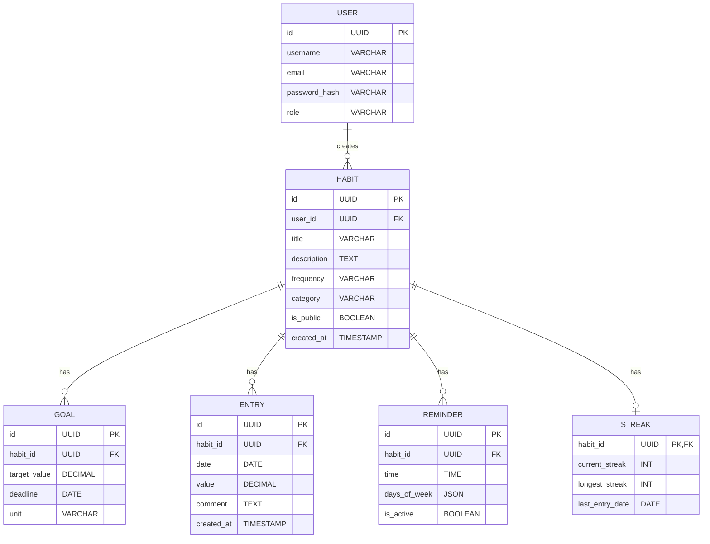

# Вариант 04 — ERD (диаграмма сущностей) — Хэбит‑трекер «Я молодец!»

Файл содержит: 1) mermaid-диаграмму ERD; 2) ASCII-эскиз; 3) минимальный SQL DDL-скетч для создания таблиц.

## Mermaid ERD



## ASCII-эскиз

```
User 1---* Habit 1---* Goal
              |---* Entry
              |---* Reminder
              |---1 Streak
```

## Минимальный SQL DDL (пример, PostgreSQL)

```postgresql
CREATE TABLE users (
                       id UUID PRIMARY KEY DEFAULT gen_random_uuid(),
                       username TEXT UNIQUE NOT NULL,
                       email TEXT UNIQUE NOT NULL,
                       password_hash TEXT NOT NULL,
                       role TEXT NOT NULL CHECK (role IN ('admin','user')),
                       created_at TIMESTAMP WITH TIME ZONE DEFAULT now()
);

CREATE TABLE habits (
                        id UUID PRIMARY KEY DEFAULT gen_random_uuid(),
                        user_id UUID NOT NULL REFERENCES users(id) ON DELETE CASCADE,
                        title TEXT NOT NULL,
                        description TEXT,
                        frequency TEXT NOT NULL CHECK (frequency IN ('daily','weekly','custom')),
                        category TEXT,
                        is_public BOOLEAN DEFAULT false,
                        created_at TIMESTAMP WITH TIME ZONE DEFAULT now()
);

CREATE TABLE goals (
                       id UUID PRIMARY KEY DEFAULT gen_random_uuid(),
                       habit_id UUID NOT NULL REFERENCES habits(id) ON DELETE CASCADE,
                       target_value DECIMAL NOT NULL,
                       deadline DATE,
                       unit TEXT
);

CREATE TABLE entries (
                         id UUID PRIMARY KEY DEFAULT gen_random_uuid(),
                         habit_id UUID NOT NULL REFERENCES habits(id) ON DELETE CASCADE,
                         date DATE NOT NULL,
                         value DECIMAL NOT NULL,
                         comment TEXT,
                         created_at TIMESTAMP WITH TIME ZONE DEFAULT now(),
                         UNIQUE(habit_id, date)
);

CREATE TABLE reminders (
                           id UUID PRIMARY KEY DEFAULT gen_random_uuid(),
                           habit_id UUID NOT NULL REFERENCES habits(id) ON DELETE CASCADE,
                           time TIME NOT NULL,
                           days_of_week JSONB NOT NULL,
                           is_active BOOLEAN DEFAULT true
);

CREATE TABLE streaks (
                         habit_id UUID PRIMARY KEY REFERENCES habits(id) ON DELETE CASCADE,
                         current_streak INTEGER DEFAULT 0,
                         longest_streak INTEGER DEFAULT 0,
                         last_entry_date DATE
);
```
