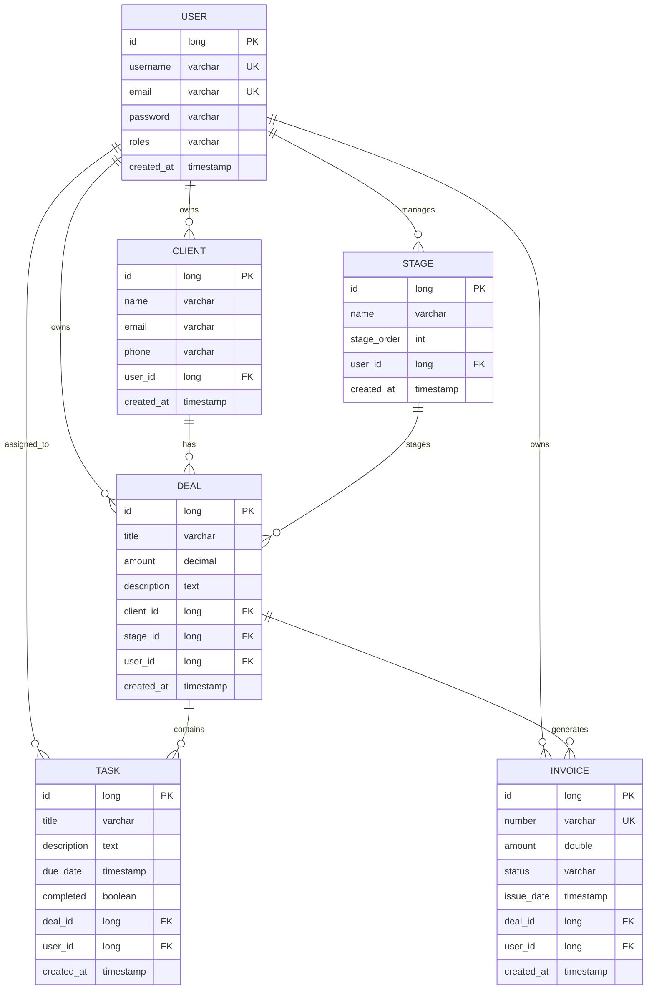

# Вариант 06 — ERD (диаграмма сущностей) — Мини-CRM Фриланс без паники

Файл содержит: 1) mermaid-диаграмму ERD; 2) ASCII-эскиз; 3) полный SQL DDL для создания таблиц с индексами.

## Mermaid ERD



## ASCII-эскиз

```
User 1---* Client 1---* Deal 1---* Task
            \            \
             \            \--- Invoice
              \
               --- Stage (1---* Deal)
```

## SQL DDL (PostgreSQL)

```sql
CREATE TABLE users (
    id BIGSERIAL PRIMARY KEY,
    username VARCHAR(255) UNIQUE NOT NULL,
    email VARCHAR(255) UNIQUE NOT NULL,
    password VARCHAR(255) NOT NULL,
    roles VARCHAR(255) NOT NULL,
    created_at TIMESTAMP DEFAULT CURRENT_TIMESTAMP
);

CREATE INDEX idx_users_username ON users(username);
CREATE INDEX idx_users_email ON users(email);

CREATE TABLE clients (
    id BIGSERIAL PRIMARY KEY,
    name VARCHAR(255) NOT NULL,
    email VARCHAR(255),
    phone VARCHAR(20),
    user_id BIGINT NOT NULL REFERENCES users(id) ON DELETE CASCADE,
    created_at TIMESTAMP DEFAULT CURRENT_TIMESTAMP
);

CREATE INDEX idx_clients_user_id ON clients(user_id);
CREATE INDEX idx_clients_name ON clients(name);

CREATE TABLE stages (
    id BIGSERIAL PRIMARY KEY,
    name VARCHAR(255) NOT NULL,
    stage_order INTEGER NOT NULL,
    user_id BIGINT REFERENCES users(id) ON DELETE SET NULL,
    created_at TIMESTAMP DEFAULT CURRENT_TIMESTAMP
);

CREATE INDEX idx_stages_user_id ON stages(user_id);
CREATE INDEX idx_stages_order ON stages(stage_order);

CREATE TABLE deals (
    id BIGSERIAL PRIMARY KEY,
    title VARCHAR(255) NOT NULL,
    amount NUMERIC(19,2),
    description TEXT,
    client_id BIGINT NOT NULL REFERENCES clients(id) ON DELETE CASCADE,
    stage_id BIGINT NOT NULL REFERENCES stages(id) ON DELETE RESTRICT,
    user_id BIGINT NOT NULL REFERENCES users(id) ON DELETE CASCADE,
    created_at TIMESTAMP DEFAULT CURRENT_TIMESTAMP
);

CREATE INDEX idx_deals_client_id ON deals(client_id);
CREATE INDEX idx_deals_stage_id ON deals(stage_id);
CREATE INDEX idx_deals_user_id ON deals(user_id);

CREATE TABLE tasks (
    id BIGSERIAL PRIMARY KEY,
    title VARCHAR(255) NOT NULL,
    description TEXT,
    due_date TIMESTAMP,
    completed BOOLEAN DEFAULT FALSE,
    deal_id BIGINT NOT NULL REFERENCES deals(id) ON DELETE CASCADE,
    user_id BIGINT NOT NULL REFERENCES users(id) ON DELETE CASCADE,
    created_at TIMESTAMP DEFAULT CURRENT_TIMESTAMP
);

CREATE INDEX idx_tasks_deal_id ON tasks(deal_id);
CREATE INDEX idx_tasks_user_id ON tasks(user_id);
CREATE INDEX idx_tasks_due_date ON tasks(due_date);

CREATE TABLE invoices (
    id BIGSERIAL PRIMARY KEY,
    number VARCHAR(50) UNIQUE NOT NULL,
    amount DOUBLE PRECISION NOT NULL,
    status VARCHAR(50) NOT NULL,
    issue_date TIMESTAMP,
    deal_id BIGINT NOT NULL REFERENCES deals(id) ON DELETE CASCADE,
    user_id BIGINT NOT NULL REFERENCES users(id) ON DELETE CASCADE,
    created_at TIMESTAMP DEFAULT CURRENT_TIMESTAMP
);

CREATE INDEX idx_invoices_number ON invoices(number);
CREATE INDEX idx_invoices_deal_id ON invoices(deal_id);
CREATE INDEX idx_invoices_user_id ON invoices(user_id);
CREATE INDEX idx_invoices_status ON invoices(status);
```
